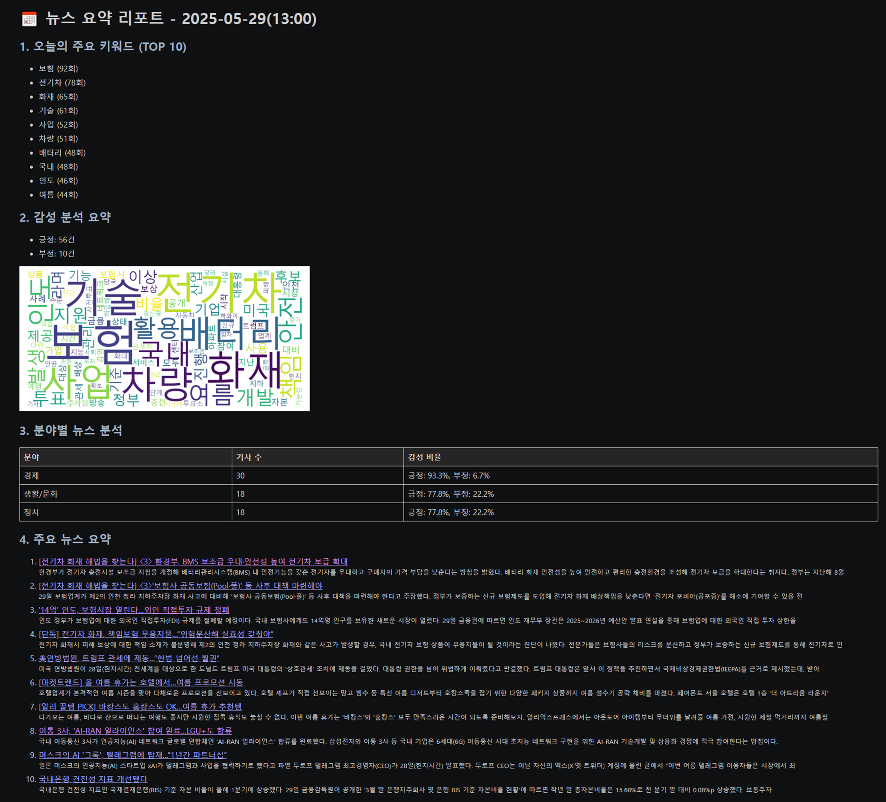

# 📰 News NLP Pipeline with Airflow

**실시간 뉴스 데이터를 수집, 전처리, 감성 분석하여 자동으로 키워드 트렌드 및 요약 리포트를 생성하는 NLP 기반 데이터 파이프라인입니다.**  
Apache Airflow를 통해 매일 자동 실행되며, 결과는 HTML 포맷으로 저장됩니다.

## 🔍 데모 이미지

| WordCloud | 감성 분석 예시 | 리포트 샘플 |
|-----------|----------------|---------------|
|  |  |  |

## 🛠 사용 기술

- **언어/라이브러리**: Python, pandas, NumPy, feedparser, BeautifulSoup, KoNLPy, WordCloud, matplotlib, seaborn, textblob-ko
- **워크플로우 오케스트레이션**: Apache Airflow
- **시각화**: WordCloud, 감성 점수 그래프
- **환경**: Docker 기반 Airflow, Linux 서버, cron 대체 자동화

## 📁 프로젝트 구조

news-nlp-pipeline/
├── dags/
│   └── news_sentiment.py          # Airflow DAG 정의
├── scripts/
│   ├── fetch_news.py              # 뉴스 수집
│   ├── extract_keywords.py        # 키워드 추출
│   ├── sentiment_analysis.py      # 감성 분석
│   ├── trend_visualization.py     # 시각화
│   ├── generate_report.py         # HTML 보고서 생성
├── templates/
│   └── report_template.html       # 리포트 템플릿
├── images/
│   ├── wordcloud_sample.png
│   ├── dag_graphview.png
│   └── report_preview.png
├── data/
│   ├── keywords_sample.json
│   ├── sentiment_sample.json
│   └── report_sample.html
├── fonts/
│   └── malgun.ttf
├── requirements.txt
├── README.md
└── LICENSE

## 🚀 실행 방법

1. Docker + Airflow 구성
```bash
git clone https://github.com/your-id/news-nlp-pipeline.git
cd news-nlp-pipeline
docker-compose up -d
Airflow 웹 UI 접속
http://localhost:8080

DAG 실행: news_sentiment
```

## ✅ 주요 기능 설명
- 뉴스 수집: Naver RSS 기반, 6개 카테고리, 당일 기사 필터링
- 본문 스크래핑: BeautifulSoup으로 기자/광고 제거 후 정제
- 키워드 추출: Okt 형태소 분석기 + 불용어 제거
- 감성 분석: textblob-ko 기반 감성 점수 계산
- 리포트 생성: HTML 기반 자동 생성
- 자동화: Airflow DAG으로 1일 3회 자동 실행

## 📦 산출물 예시

| 파일명 | 설명 |
|--------|------|
| `news_YYYYMMDD.csv` | 수집 뉴스 원본 |
| `keywords_YYYYMMDD.json` | 키워드 리스트 |
| `sentiment_YYYYMMDD.json` | 키워드별 감성 점수 |
| `report_YYYYMMDD.html` | 최종 HTML 보고서 |

## 🧩 Airflow DAG 흐름


- fetch_news → preprocess_and_extract_keywords → sentiment_analysis → generate_report

## 📈 향후 개선 방향

- 감성 분석 모델 커스터마이징 (KoBERT 등으로 확장)
- 뉴스 요약 기능 추가 (extractive / abstractive)
- 이메일 자동 전송 기능
- 사용자 정의 키워드 분석 요청 인터페이스

## 🧾 라이선스

본 프로젝트는 MIT 라이선스를 따릅니다.